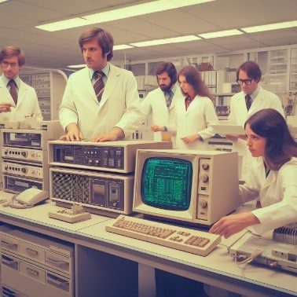

# Reporte de forma de vidas digitales
<h1>Informe: 2000</h1>
Durante la ultima decada del siglo XX mientras un equipo de investigadores investigaban el funcionamiento del internet y sus posibles nuevos usos se encontraron con progrmas que se confundieron con virus informaticos, los cuales afectaban las computadoras y las redes desde las que se interactavan con estos, terminando en que los dispositivos terminaran infectando y habitando estos.

